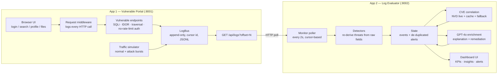
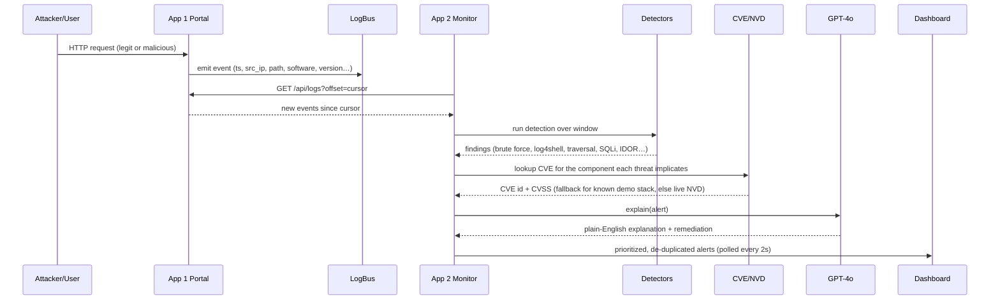

# Log Generation & CVE-Aware Threat Detection

Two independent applications that together demonstrate **PS-3: Log Generation &
CVE-Aware Threat Detection**.

| App | Role | Stack | Port |
|-----|------|-------|------|
| **App 1 — Vulnerable Portal** (`app1-vulnerable-app`) | A *real, working* web app ("ACME Portal") with intentional, exploitable flaws. Every legitimate and malicious action is emitted to a live, streamable log feed. | FastAPI + vanilla HTML/JS | `8001` |
| **App 2 — Log Evaluator** (`app2-log-evaluator`) | Continuously monitors App 1's live logs, independently re-derives threats, correlates them with CVEs (live NVD + cache + curated fallback), and enriches each alert with a GPT-4o explanation + remediation. | FastAPI + vanilla HTML/JS | `8002` |

The two apps share **no code and no memory** — App 2 only consumes App 1 over
HTTP, exactly as a real SIEM would consume a log source.

---

## Architecture



### Data flow (one cycle)



---

## Quick start (Windows, bash shell)

A shared virtualenv lives at `.venv`. From the project root:

```bash
# 1. install deps (already pinned for Python 3.14)
./.venv/Scripts/python.exe -m pip install -r app1-vulnerable-app/backend/requirements.txt
./.venv/Scripts/python.exe -m pip install -r app2-log-evaluator/backend/requirements.txt

# 2. (optional) enable GPT-4o explanations — without this the evaluator uses a
#    deterministic template fallback that produces the same structured output.
export OPENAI_API_KEY=sk-...

# 3. start App 1 (vulnerable portal) on :8001
./.venv/Scripts/python.exe -m uvicorn main:app --host 127.0.0.1 --port 8001 \
  --app-dir app1-vulnerable-app/backend

# 4. in a second terminal, start App 2 (log evaluator) on :8002
AUTO_MONITOR=1 APP1_URL=http://127.0.0.1:8001 POLL_INTERVAL=2 \
  ./.venv/Scripts/python.exe -m uvicorn main:app --host 127.0.0.1 --port 8002 \
  --app-dir app2-log-evaluator/backend
```

Then open:

- **Portal:** http://127.0.0.1:8001 — drive it by hand, or click **Start
  simulation** to generate a burst of normal + attack traffic.
- **Evaluator dashboard:** http://127.0.0.1:8002 — watch alerts appear live as
  App 2 polls and analyses the feed.

To generate traffic from the command line instead of the UI:

```bash
curl -s -X POST http://127.0.0.1:8001/api/sim/start -H "Content-Type: application/json" \
  -d '{"duration_sec":8,"rate":5,"brute_force_n":12,
       "attacks":{"brute_force":true,"sql_injection":true,
                  "path_traversal":true,"log4shell":true,"idor":true}}'
```

---

## The vulnerable stack and its CVEs

App 1 advertises a deliberately outdated stack. App 2 maps each detected threat
to the component it *actually* implicates (not merely the server that logged the
request), then correlates a canonical CVE:

| Component | Version | Threat that implicates it | CVE | CVSS |
|-----------|---------|---------------------------|-----|------|
| Apache HTTP Server | 2.4.49 | Path traversal | CVE-2021-41773 | 7.5 |
| Apache Log4j2 | 2.14.1 | Log4Shell (JNDI in headers) | CVE-2021-44228 | 10.0 |
| OpenSSL | 1.0.1 | (inventory scan — Heartbleed) | CVE-2014-0160 | 7.5 |
| OpenSSH | 8.1 | Brute force / successful brute force | CVE-2020-15778 | 7.8 |

Application-logic flaws — **SQL injection**, **XSS**, **IDOR enumeration** —
correctly carry **no stack-component CVE** (they are coding flaws, not a
vulnerable dependency); their alerts still get severity, evidence, and a
remediation playbook.

### Why a curated fallback?

NVD keyword search is noisy (e.g. searching "OpenSSH 8.1" surfaces an unrelated
CVSS-10 entry that merely contains the substring "8.1"). For the four known demo
components the evaluator therefore trusts a **curated, canonical CVE mapping**;
for any *other* component it falls back to live NVD, requiring the description to
cite both the product name and the exact version (word-boundary matched) before
trusting a result. Results are cached to `app2-log-evaluator/cache/nvd_cache.json`.

---

## Independent detection

App 2 does **not** trust any `attack_class` label App 1 attaches. It re-derives
every threat from raw fields:

| Threat | How it is detected |
|--------|--------------------|
| `brute_force` / `brute_force_success` | ≥10 `auth_failure` from one (ip, user); escalates to CRITICAL if an `auth_success` follows the burst |
| `log4shell` | `${jndi:ldap/rmi/dns` in path or user-agent |
| `path_traversal` | `../`, `%2e%2e`, `/etc/passwd`, etc. in path |
| `sql_injection` | `union/select/drop`, `or 1=1`, `'--` in path |
| `xss` | `<script`, `onerror=`, `javascript:` in path |
| `idor_enumeration` | ≥4 distinct object ids on `/api/users/{id}` from one ip |

Findings use stable keys, so re-analysing a growing window **updates** an
existing alert rather than duplicating it.

---

## Deliverables in this repo

- `app1-vulnerable-app/` — vulnerable portal (backend + frontend + `README.md`)
- `app2-log-evaluator/` — log evaluator (backend + frontend + `README.md`)
- `docs/sample_alerts.json` — one representative enriched alert per threat type
- `docs/demo_dataset.jsonl` — raw log events captured from a simulator run
- This `README.md` — architecture, data flow, and run instructions
